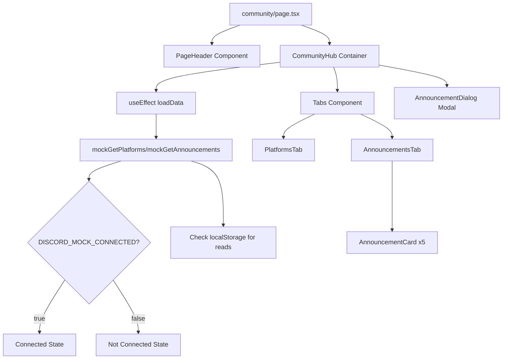

# Community Dashboard Integration Plan

## Overview

Implement a community dashboard following the affiliate dashboard's modular pattern, with Discord platform integration and announcement system. Uses feature flags for testing Discord states and reuses existing skeleton loading components.

**Timeline:** 3 hours

**Pattern Reference:** [`apps/web/modules/saas/affiliate/`](apps/web/modules/saas/affiliate/)

---

## Phase 1: Foundation Setup (30 minutes)

### 1.1 Create Module Structure

Create directories:

```
apps/web/modules/saas/community/
├── components/
└── lib/
```

### 1.2 Create Types File

**File:** [`apps/web/modules/saas/community/lib/types.ts`](apps/web/modules/saas/community/lib/types.ts)

Define interfaces:

```typescript
export interface Platform {
  id: string;
  name: string;
  description: string;
  connected: boolean;
  username?: string | null;
  url?: string;
}

export interface Announcement {
  id: string;
  title: string;
  content: string;
  fullContent: string;
  date: string;
  type: "welcome" | "event" | "update" | "feature" | "maintenance" | "community";
  priority: "urgent" | "important" | "normal";
  author: string;
  read?: boolean;
}
```

### 1.3 Add Feature Flag (Simplified Testing)

**File:** [`apps/web/lib/dev-tools.ts`](apps/web/lib/dev-tools.ts)

Add to FEATURE_FLAGS:

```typescript
export const FEATURE_FLAGS = {
  // ... existing flags
  DISCORD_MOCK_CONNECTED: process.env.NEXT_PUBLIC_DISCORD_MOCK_CONNECTED === 'true',
} as const;
```

### 1.4 Update Mock Data

**File:** [`apps/web/lib/mock-data.ts`](apps/web/lib/mock-data.ts)

Add imports:

```typescript
import type { Platform, Announcement } from "@/modules/saas/community/lib/types";
```

Add to mockUser (only missing field):

```typescript
export const mockUser = {
  // ... existing fields
  discordUsername: null as string | null,  // ADD THIS
  // ... rest
};
```

Add mock data arrays at bottom:

```typescript
export const mockPlatforms: Platform[] = [
  {
    id: "discord",
    name: "Discord",
    description: "Connect to access exclusive channels, member-only content, and real-time community support.",
    connected: false,
    username: null,
    url: "https://discord.gg/lifepreneur"
  }
];

export const mockAnnouncements: Announcement[] = [
  {
    id: "ann-001",
    title: "Welcome to Lifepreneur Community!",
    content: "Connect your Discord account to unlock full access to our community features. Join live discussions, get instant support, and participate in exclusive member events.",
    fullContent: `Welcome to the Lifepreneur Community! We're thrilled to have you here as part of our growing community.

By connecting your Discord account, you'll unlock a wealth of exclusive features including:

• Access to member-only channels with expert discussions
• Real-time community support from our dedicated team
• Exclusive member events, AMAs, and workshops
• Early access to new features and beta programs
• Direct networking opportunities with fellow members

To get started, simply click the 'Connect Discord' button in the Platforms tab. The setup takes less than 30 seconds and you'll immediately gain access to all community features.

If you have any questions or need assistance, our community managers are always available in the #help channel. Welcome aboard!`,
    date: new Date(Date.now() - 3 * 24 * 60 * 60 * 1000).toISOString(),
    type: "welcome",
    priority: "important",
    author: "Kyle (Founder)",
  },
  {
    id: "ann-002",
    title: "New Video Series: Advanced Product Research",
    content: "Learn cutting-edge product research strategies with our new 6-part video series. Discover techniques used by top entrepreneurs to find winning products.",
    fullContent: `We're excited to launch our new Advanced Product Research video series!

This comprehensive 6-part series covers:

• Market trend analysis and prediction
• Competitor research deep-dives
• Data-driven product validation
• Niche selection frameworks
• Supplier sourcing strategies
• Launch preparation checklists

Each video includes downloadable worksheets, real case studies, and actionable templates you can use immediately.

The series is available now in the #video-library channel. New members get lifetime access to all content.

Start watching today and take your product research to the next level!`,
    date: new Date(Date.now() - 8 * 24 * 60 * 60 * 1000).toISOString(),
    type: "feature",
    priority: "normal",
    author: "Kyle (Founder)",
  },
  {
    id: "ann-003",
    title: "Discord Office Hours - Every Tuesday 2pm EST",
    content: "Join us for weekly office hours where Kyle answers your questions live. Bring your TikTok Shop challenges and let's solve them together.",
    fullContent: `Weekly Discord Office Hours - Every Tuesday at 2pm EST

Join Kyle for live Q&A sessions every Tuesday at 2pm EST in our Discord community!

What to expect:

• Live answers to your TikTok Shop questions
• Screen sharing for product research walkthroughs
• Community discussion and networking
• Guest appearances from successful members
• Recording available for those who can't attend live

Topics we cover:
• Product research and validation
• Content creation strategies
• Advertising and organic growth
• Fulfillment and logistics
• Scaling your business

No question is too basic or too advanced. This is YOUR time to get personalized guidance.

Mark your calendar and we'll see you there!`,
    date: new Date(Date.now() - 10 * 24 * 60 * 60 * 1000).toISOString(),
    type: "event",
    priority: "important",
    author: "Kyle (Founder)",
  },
  {
    id: "ann-004",
    title: "Affiliate Program Launch!",
    content: "Our affiliate program is now live! Earn 30% recurring commission by sharing Lifepreneur with your audience. Check the Affiliate tab for your tracking links.",
    fullContent: `🎉 Affiliate Program is Now Live!

We're excited to announce the launch of the Lifepreneur Affiliate Program!

Program Details:

• 30% recurring commission on all referrals
• 90-day cookie duration
• Custom tracking links and resources
• Real-time dashboard with analytics
• Monthly payouts via PayPal, Wise, or custom methods
• Dedicated affiliate support

Who should join:
• Content creators in the e-commerce space
• TikTok Shop educators
• Business coaches and consultants
• Anyone with an audience interested in entrepreneurship

Getting Started:
1. Go to the Affiliate tab in your dashboard
2. Opt-in to the program
3. Get your custom tracking links
4. Start sharing and earning!

We provide marketing materials, proven copy, and ongoing support to help you succeed.

Questions? Reach out to affiliate@lifepreneur.com or ask in Discord.`,
    date: new Date(Date.now() - 14 * 24 * 60 * 60 * 1000).toISOString(),
    type: "feature",
    priority: "normal",
    author: "Kyle (Founder)",
  },
  {
    id: "ann-005",
    title: "Platform Maintenance - December 15th",
    content: "Important: We'll be performing critical system maintenance on December 15th from 2am-5am EST. Platform will be temporarily unavailable.",
    fullContent: `Critical Platform Maintenance Notice

We're conducting essential system maintenance on December 15th from 2:00 AM to 5:00 AM EST.

What to expect:

• Complete platform downtime during the maintenance window
• Discord will remain fully functional
• All data is safely backed up - no action needed from you
• Email notifications will continue working

What we're updating:
• Critical security patches
• Performance optimization upgrades
• New feature infrastructure
• Database improvements

We apologize for any inconvenience. This maintenance ensures the best possible experience for our community.

Questions? Reach out to our team on Discord anytime.`,
    date: new Date(Date.now() - 21 * 24 * 60 * 60 * 1000).toISOString(),
    type: "maintenance",
    priority: "urgent",
    author: "Tech Team",
  },
];
```

### 1.5 Add Mock API Functions

**File:** [`apps/web/lib/mock-api.ts`](apps/web/lib/mock-api.ts)

Import types and add at bottom:

```typescript
import type { Platform, Announcement } from "@/modules/saas/community/lib/types";
import { FEATURE_FLAGS } from './dev-tools';

export async function mockGetPlatforms(): Promise<Platform[]> {
  await new Promise((resolve) => setTimeout(resolve, 300));
  
  const isDiscordConnected = FEATURE_FLAGS.DISCORD_MOCK_CONNECTED;
  
  return mockPlatforms.map(platform => ({
    ...platform,
    connected: platform.id === "discord" ? isDiscordConnected : false,
    username: platform.id === "discord" && isDiscordConnected ? "@kyle_lifepreneur" : null,
  }));
}

export async function mockGetAnnouncements(): Promise<Announcement[]> {
  await new Promise((resolve) => setTimeout(resolve, 300));
  
  return mockAnnouncements.map(announcement => ({
    ...announcement,
    read: isAnnouncementRead(announcement.id),
  })).sort((a, b) => new Date(b.date).getTime() - new Date(a.date).getTime());
}

// Helper functions for announcement read status
export function isAnnouncementRead(announcementId: string): boolean {
  if (typeof window === "undefined") return false;
  return localStorage.getItem(`announcement-${announcementId}-read`) === "true";
}

export function markAnnouncementAsRead(announcementId: string): void {
  if (typeof window === "undefined") return;
  localStorage.setItem(`announcement-${announcementId}-read`, "true");
  console.log(`✓ Marked announcement ${announcementId} as read`);
}

export function markAnnouncementAsUnread(announcementId: string): void {
  if (typeof window === "undefined") return;
  localStorage.removeItem(`announcement-${announcementId}-read`);
  console.log(`○ Marked announcement ${announcementId} as unread`);
}

export function markAllAnnouncementsAsRead(): void {
  if (typeof window === "undefined") return;
  mockAnnouncements.forEach(announcement => {
    localStorage.setItem(`announcement-${announcement.id}-read`, "true");
  });
  console.log(`✓ Marked all ${mockAnnouncements.length} announcements as read`);
}

export function formatRelativeDate(dateString: string): string {
  const date = new Date(dateString);
  const now = new Date();
  const diffInMs = now.getTime() - date.getTime();
  const diffInDays = Math.floor(diffInMs / (1000 * 60 * 60 * 24));

  if (diffInDays === 0) return "Today";
  if (diffInDays === 1) return "Yesterday";
  if (diffInDays < 7) return `${diffInDays} days ago`;
  if (diffInDays < 14) return "1 week ago";
  if (diffInDays < 30) return `${Math.floor(diffInDays / 7)} weeks ago`;
  
  return date.toLocaleDateString("en-US", { 
    month: "short", 
    day: "numeric", 
    year: "numeric" 
  });
}
```

**Checkpoint:** Types defined, mock data added, feature flag ready.

---

## Phase 2: Core Components (50 minutes)

### 2.1 Discord Icon Component

**File:** [`apps/web/modules/saas/community/components/discord-icon.tsx`](apps/web/modules/saas/community/components/discord-icon.tsx)

Simple SVG component (copy from v0 code):

```typescript
interface DiscordIconProps {
  className?: string;
}

export function DiscordIcon({ className }: DiscordIconProps) {
  return <svg viewBox="0 0 24 24" fill="currentColor" className={className}>
    {/* SVG path from v0 */}
  </svg>;
}
```

### 2.2 Main Container Component

**File:** [`apps/web/modules/saas/community/components/community-hub.tsx`](apps/web/modules/saas/community/components/community-hub.tsx)

State management and tabs structure:

```typescript
"use client"
import { useState, useEffect } from "react"
import { Tabs, TabsContent, TabsList, TabsTrigger } from "@ui/components/tabs"
import { Skeleton } from "@ui/components/skeleton"
import { Alert, AlertDescription } from "@ui/components/alert"
import { Bell, Users } from "lucide-react"
import { PlatformsTab } from "./platforms-tab"
import { AnnouncementsTab } from "./announcements-tab"
import { AnnouncementDialog } from "./announcement-dialog"
import type { Platform, Announcement } from "../lib/types"
import { mockGetPlatforms, mockGetAnnouncements } from "@/lib/mock-api"

// State: loading, error, platforms, announcements, selectedAnnouncement, filter
// Loading skeleton (reuse pattern from streaming-library)
// Error state with Alert component
// Tabs with PlatformsTab and AnnouncementsTab
```

### 2.3 Update Community Page Route

**File:** [`apps/web/app/(saas)/app/(account)/community/page.tsx`](apps/web/app/\\\\(saas)/app/(account)/community/page.tsx)

Replace placeholder with:

```typescript
import { PageHeader } from "@saas/shared/components/PageHeader";
import { CommunityHub } from "@/modules/saas/community/components/community-hub";

export default function CommunityPage() {
  return (
    <>
      <PageHeader
        title="Community Hub"
        subtitle="Connect with platforms and stay updated with announcements"
      />
      <CommunityHub />
    </>
  );
}
```

**Checkpoint:** Core container with loading/error states, page route updated.

---

## Phase 3: Platforms Tab (40 minutes)

### 3.1 Platforms Tab Component

**File:** [`apps/web/modules/saas/community/components/platforms-tab.tsx`](apps/web/modules/saas/community/components/platforms-tab.tsx)

Props-based component:

```typescript
"use client"
import { Badge } from "@ui/components/badge"
import { Button } from "@ui/components/button"
import { Card, CardContent, CardHeader, CardTitle } from "@ui/components/card"
import { CheckCircle2, Clock, ExternalLink } from "lucide-react"
import { DiscordIcon } from "./discord-icon"
import type { Platform } from "../lib/types"

interface PlatformsTabProps {
  platforms: Platform[];
  onConnect: (platformId: string) => void;
  onDisconnect: (platformId: string) => void;
}

// Helper: getPlatformIcon(platformId) returns <DiscordIcon /> for discord
// Render: Discord card with connected/not connected states
// Future platforms card with "Coming Soon"
```

### 3.2 Connect Handlers in Hub

Add to community-hub.tsx:

```typescript
const handleConnect = (platformId: string) => {
  alert("Discord OAuth will be implemented in Week 4");
  // Week 4: window.location.href = "/api/auth/discord";
};

const handleDisconnect = (platformId: string) => {
  alert("Disconnect will be implemented in Week 4");
};
```

**Checkpoint:** Platforms tab displays Discord connection status correctly.

---

## Phase 4: Announcements System (60 minutes)

### 4.1 Announcements Tab Component

**File:** [`apps/web/modules/saas/community/components/announcements-tab.tsx`](apps/web/modules/saas/community/components/announcements-tab.tsx)

```typescript
"use client"
import { Badge } from "@ui/components/badge"
import { Button } from "@ui/components/button"
import { Card, CardContent } from "@ui/components/card"
import { Bell, BellOff, CheckCheck } from "lucide-react"
import { AnnouncementCard } from "./announcement-card"
import type { Announcement } from "../lib/types"

interface AnnouncementsTabProps {
  announcements: Announcement[];
  filter: "all" | "unread";
  onFilterChange: (filter: "all" | "unread") => void;
  onMarkAsRead: (id: string) => void;
  onMarkAllAsRead: () => void;
  onAnnouncementClick: (announcement: Announcement) => void;
}

// Header card with counts, filters, Mark All Read
// Map announcements to AnnouncementCard components
// Empty state when no announcements match filter
```

### 4.2 Announcement Card Component

**File:** [`apps/web/modules/saas/community/components/announcement-card.tsx`](apps/web/modules/saas/community/components/announcement-card.tsx)

```typescript
"use client"
import { Badge } from "@ui/components/badge"
import { Button } from "@ui/components/button"
import { Card, CardContent } from "@ui/components/card"
import { AlertCircle, AlertTriangle, CheckCircle2, Circle, Info } from "lucide-react"
import type { Announcement } from "../lib/types"
import { formatRelativeDate } from "@/lib/mock-api"

interface AnnouncementCardProps {
  announcement: Announcement;
  onMarkAsRead: (id: string) => void;
  onClick: () => void;
}

// Helper: getPriorityIcon(priority) returns appropriate icon with color
// Visual: Different opacity for read/unread
// Priority badge for urgent/important
// "New" badge for unread
// Mark as Read button on unread cards
```

### 4.3 Announcement Dialog Component

**File:** [`apps/web/modules/saas/community/components/announcement-dialog.tsx`](apps/web/modules/saas/community/components/announcement-dialog.tsx)

```typescript
"use client"
import { Badge } from "@ui/components/badge"
import { Button } from "@ui/components/button"
import { Dialog, DialogContent, DialogHeader, DialogTitle } from "@ui/components/dialog"
import { Eye, EyeOff } from "lucide-react"
import type { Announcement } from "../lib/types"

interface AnnouncementDialogProps {
  announcement: Announcement | null;
  isOpen: boolean;
  onClose: () => void;
  onToggleRead: (id: string) => void;
}

// Full content display with line break preservation
// Mark as Read/Unread toggle button
// Mobile-optimized scrolling
```

### 4.4 Add State Management to Hub

In community-hub.tsx:

```typescript
const [selectedAnnouncement, setSelectedAnnouncement] = useState<Announcement | null>(null);
const [announcementFilter, setAnnouncementFilter] = useState<"all" | "unread">("all");

const toggleReadStatus = (id: string) => {
  const announcement = announcements.find((a) => a.id === id);
  if (!announcement) return;
  
  if (announcement.read) {
    markAnnouncementAsUnread(id);
  } else {
    markAnnouncementAsRead(id);
  }
  
  setAnnouncements(announcements.map((a) => a.id === id ? { ...a, read: !a.read } : a));
};

// Add markAllAsRead, handleAnnouncementClick handlers
```

**Checkpoint:** Announcements system fully functional with read/unread tracking.

---

## Phase 5: Testing & Polish (30 minutes)

### 5.1 Test Discord States

```bash
# Test connected state
echo 'NEXT_PUBLIC_DISCORD_MOCK_CONNECTED=true' >> .env.local
# Refresh browser, verify Discord shows connected

# Test not connected state
# Remove or set to false in .env.local
# Verify Discord shows not connected with benefits list

# When switching between Discord states during testing:
# 1. Update .env.local with new value
# 2. Clear localStorage in browser console: localStorage.clear()
# 3. Refresh page
# This ensures announcement read states don't carry over between test runs
```

### 5.2 Test Announcements

- Verify all 5 announcements display
- Test Mark as Read on individual announcements
- Test Mark All Read functionality
- Test filter toggle (All/Unread)
- Test announcement dialog opens/closes
- Verify localStorage persistence across refreshes

### 5.3 Responsive Testing

- Test at 375px (mobile), 768px (tablet), 1024px (desktop)
- Verify touch targets minimum 44px
- Check spacing matches v0 design

### 5.4 Build Verification

```bash
npm run build
```

- Fix any TypeScript errors
- Fix any import path issues
- Verify no console errors in dev mode

**Checkpoint:** All tests passing, build successful, ready to deploy.

---

## Key Technical Details

### Import Pattern (Critical)

```typescript
// UI Components - NO /ui/ after @ui/components/
import { Card } from "@ui/components/card"  // CORRECT
import { Button } from "@ui/components/button"  // CORRECT

// Local Components
import { DiscordIcon } from "./discord-icon"

// Types
import type { Platform } from "../lib/types"

// Mock API
import { mockGetPlatforms } from "@/lib/mock-api"

// Shared Components
import { PageHeader } from "@saas/shared/components/PageHeader"

// Icons
import { Bell, Users } from "lucide-react"
```

### Loading Skeleton (Reuse Existing Pattern)

From [`apps/web/modules/saas/content/components/streaming-library.tsx`](apps/web/modules/saas/content/components/streaming-library.tsx):

```typescript
if (loading) {
  return (
    <div className="container mx-auto max-w-7xl px-4 py-8">
      <div className="space-y-6">
        <div className="h-12 w-full max-w-md bg-primary/10 rounded animate-pulse" />
        {Array.from({ length: 3 }, (_, i) => (
          <Skeleton key={`card-${i}`} className="w-full h-48" />
        ))}
      </div>
    </div>
  );
}
```

### Data Flow



### Component Structure

```
modules/saas/community/
├── components/
│   ├── community-hub.tsx           (Main container, 200 lines)
│   ├── platforms-tab.tsx           (Discord card, 150 lines)
│   ├── announcements-tab.tsx       (List + filters, 150 lines)
│   ├── announcement-card.tsx       (Individual card, 100 lines)
│   ├── announcement-dialog.tsx     (Modal, 100 lines)
│   └── discord-icon.tsx            (SVG, 20 lines)
└── lib/
    └── types.ts                     (Interfaces, 40 lines)
```

### Week 4 Migration Notes

When implementing real Discord OAuth:

1. Replace `handleConnect` alert with: `window.location.href = "/api/auth/discord"`
2. Create Discord OAuth routes: `/api/auth/discord` and `/api/auth/discord/callback`
3. Replace localStorage announcement reads with database queries
4. Remove `DISCORD_MOCK_CONNECTED` feature flag
5. Add Discord fields to database schema

---

## Success Criteria

- Page loads at /app/community without errors
- Discord connection status toggles via feature flag
- All 5 announcements display with correct priority
- Read/unread tracking persists in localStorage
- Modal opens/closes properly
- Mobile responsive at all breakpoints
- Build succeeds with no TypeScript errors
- Visual match with v0 design

---

## Reference Documents

- Import paths: [`IMPORT-PATHS-REFERENCE.md`](docs/architecture/Community-dash-integration/Community-architecture-integration/corrected-post-audit-implementation/IMPORT-PATHS-REFERENCE.md)
- Component architecture: [`COMPONENT-ARCHITECTURE-SPEC.md`](docs/architecture/Community-dash-integration/Community-architecture-integration/corrected-post-audit-implementation/COMPONENT-ARCHITECTURE-SPEC.md)
- Mock data specs: [`MOCK-DATA-SPECIFICATIONS.md`](docs/architecture/Community-dash-integration/Community-architecture-integration/corrected-post-audit-implementation/MOCK-DATA-SPECIFICATIONS.md)
- v0 original: [`community-hub.tsx`](docs/architecture/Community-dash-integration/v0-files/Community-Dash/components/community-hub.tsx)