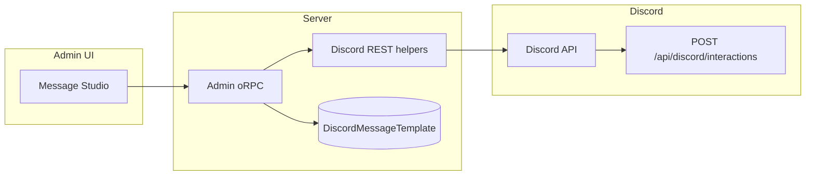

# Discord Admin Message Studio — Implementation Plan

## Goals

- **One admin UI** (under existing **Admin → Discord**) to build Discord messages without hand-writing JSON.
- **Post** new messages and **edit** existing ones in place (Carl-style: paste **message link** → load → save).
- **Channel targeting:** primary **guild channel list** from Discord API; **fallback: channel ID** text field.
- **Templates in DB** so copy, embeds, and link URLs change **without redeploy** (only data + Discord PATCH).
- **Preset action buttons** with **fixed `custom_id`** values implemented in code (no free-text IDs). **Link buttons** are user-defined label + URL.
- **Onboarding preset** removes a role whose ID comes from **`DISCORD_NOT_ONBOARDED_ROLE_ID`** (same pattern as other Discord role env vars).

## Non-goals (v1)

- Scheduling, reaction roles, multi-guild, arbitrary `custom_id` entry.
- **Components V2–only** messages (see glossary below). We **do** use **message components** (buttons).

### Glossary: “components” vs “Components V2”

- **Message components (buttons, selects):** Yes, we use these. They go in the `components` array on the message (action rows + buttons). Your **Upgrade** / **Onboarding** buttons are exactly this.
- **Legacy message format:** Discord allows **`content`** + **`embeds`** + **`components`** together on one message. This is the common pattern for “embed + buttons” and matches what `discord.js` / most bots use.
- **Components V2** (`IS_COMPONENTS_V2` flag): Discord’s **newer** layout system (Text Display, Container, Section, Media Gallery, etc.). Documented and supported in production — **not** “beta” in the sense of unofficial. Tradeoffs for **Message Studio v1**:
  - **Different payload model:** With V2, classic **`content` / `embeds` are not used** on that message the same way; you build from V2 component types instead. That’s a **second composer**, validation path, and **GET → edit → PATCH** round-trip in the admin UI.
  - **Ecosystem:** Most bots, Carl-style tools, and your **existing** messages use **legacy**. Mixing “edit Carl message” vs “edit V2 message” needs branching.
  - **Scope:** Shipping V2 well means designing forms for Containers, Sections, Media Gallery, etc., not just mapping embed fields.

**Plan:** v1 Message Studio uses **legacy** `content` + **full embed** + **components** (buttons). This matches your live server and minimizes risk of **scope creep**. **Components V2** is a deliberate **Phase D** (or later) if you want that layout language—not because V2 is untested, but because it’s a **parallel product surface** worth its own milestone.

### Glossary: JSON `payload` column vs “following the API”

- **To Discord:** The server still builds a body that matches **[Create Message](https://discord.com/developers/docs/resources/channel#create-message)** / **Edit Message** (`content`, `embeds[]`, `components[]`).
- **In our database:** We can either (a) store one **JSON blob** (`payload`) that mirrors what we send, or (b) **normalize** into many columns (`embed_title`, `embed_footer_text`, `button_1_url`, …).

**Why JSON blob for v1:** Faster to ship, fewer migrations when we add a field, and the stored shape can stay aligned with the API object. **Alternative (normalized columns)** is stricter SQL reporting, more tables/migrations. Both approaches **follow** the Discord API at send time; the choice is only **how we persist templates**.

---

## Architecture

- **Admin UI** calls **admin-only oRPC** procedures.
- Procedures use **`@repo/discord`** (or colocated) **REST** helpers with `DISCORD_BOT_TOKEN` + `getDiscordBotUserAgent()`.
- **Templates** persist form state + `channelId` + `messageId` after first successful post.
- **Button clicks** for action presets still hit **existing** Vercel route **`/api/discord/interactions`** (signature verification unchanged).

---

## Data model (proposed)

**Table `DiscordMessageTemplate`** (name TBD in schema):

| Column | Purpose |
|--------|---------|
| `id` | CUID |
| `name` | Admin-facing label (e.g. "TikTok commission Jan") |
| `channelId` | Last target channel snowflake |
| `messageId` | Set after first post; enables PATCH |
| `payload` | JSON: content, embed fields, link buttons array, selected **action preset key** (nullable), optional button labels for presets |
| `createdAt` / `updatedAt` | Audit |
| `updatedByUserId` | Optional FK to admin who last saved |

**Alternative:** normalize embed/buttons into columns; v1 **JSON `payload`** is faster to ship and serializes the same fields Discord accepts on the wire.

---

## Discord API surface (server-side)

| Operation | HTTP | Notes |
|-----------|------|--------|
| List channels | `GET /guilds/{DISCORD_GUILD_ID}/channels` | Filter to text/announcement forums as needed for dropdown |
| Create message | `POST /channels/{channel_id}/messages` | Body: `content`, `embeds[]`, `components[]` |
| Get message | `GET /channels/{channel_id}/messages/{message_id}` | Populate editor when editing |
| Edit message | `PATCH /channels/{channel_id}/messages/{message_id}` | Same body shape as create (partial allowed per Discord docs) |

**Message link parsing:** Regex or URL parse for `discord.com/channels/{guild}/{channel}/{message}` (and `discordapp.com`) → extract `channelId`, `messageId`; verify `guild` matches `DISCORD_GUILD_ID` before calling API.

---

## Preset registry (v1)

| Preset key | Button style | `custom_id` | Server behavior |
|------------|--------------|-------------|-----------------|
| *(none)* | — | — | Link buttons only or no buttons |
| `billing_upgrade` | Primary (1) | `billing_upgrade` | Existing: Stripe portal + DB lookup |
| `onboarding_complete` | Primary (1) | `onboarding_complete` | **New:** remove role `DISCORD_NOT_ONBOARDED_ROLE_ID` for clicker; ephemeral success/error |

**Link buttons:** N rows of `{ label, url }` → `style: 5`, max 5 per action row, max 5 rows per message (Discord limits).

**UI:** Dropdown “Action preset”; when set, show extra field **Button label** only (and use template body for copy). No env for `billing_upgrade`; onboarding uses env for **role ID only**.

---

## Interactions route changes

**File:** `apps/web/app/api/discord/interactions/route.ts`

- Extend `DiscordInteractionBody` / handler for `custom_id === "onboarding_complete"`.
- Load `process.env.DISCORD_NOT_ONBOARDED_ROLE_ID`; if unset, ephemeral error.
- Resolve Discord user id from interaction; **DB guard (confirmed):** require linked user + active/paid access (or equivalent) before removing role — extra layer against people who should not complete onboarding in Discord.
- Call existing **`restRemoveMemberRole`** (or equivalent from `@repo/discord/lib/manage-roles`) with audit reason `Lifepreneur: onboarding complete`.

**Developer Portal:** **No change** to **Interactions Endpoint URL** when adding `onboarding_complete`. Discord always POSTs to the **same** URL; the handler branches on `custom_id`. Only update the portal if your **domain** or **path** changes.

---

## Admin UI (page structure)

**Route:** e.g. `apps/web/app/(admin)/admin/discord/message-studio/page.tsx` (exact path aligned with existing Discord admin nav).

**Sections:**

1. **Template list / selector** — load saved templates; New template.
2. **Mode tabs** — Create | Edit (Edit shows message link input + **Load**).
3. **Channel** — Select from API list; optional **Channel ID** override.
4. **Content** — multiline `content`; optional **full embed** (all fields we want to support per [embed structure](https://discord.com/developers/docs/resources/message#embed-object): title, description, url, color, timestamp, footer, image, thumbnail, author, fields).
5. **Link buttons** — dynamic list (label + URL).
6. **Action preset** — select + preset button label.
7. **Actions** — **Post** (if no `messageId`) | **Update** (if `messageId` + channel); toast + save template.

**Safety (Phase C):** After **Load**, if the message **`author.id`** ≠ your **application’s bot user id**, show a confirm (or block). **Why:** An admin could paste a **wrong** link (human message, Carl, another bot); Discord may **reject** PATCH if the bot cannot edit that message.

---

## Security & ops

- All new procedures: **adminProcedure**, available to **admins and owners** (nav visibility for admins can be refined later).
- **Rate limit** post/patch per admin user (reuse existing rate-limit middleware if present).
- **Audit:** log admin user id, channel id, message id, template name on post/patch.
- **Env on Vercel:** `DISCORD_BOT_TOKEN`, `DISCORD_GUILD_ID`, `DISCORD_PUBLIC_KEY`, `STRIPE_SECRET_KEY`, `DATABASE_URL`, `NEXT_PUBLIC_APP_URL`, **`DISCORD_NOT_ONBOARDED_ROLE_ID`** (when onboarding ships).

---

## Implementation phases

### Phase A — Foundation (no onboarding handler yet)

1. Prisma model + migration.
2. Discord REST helpers (list channels, create/get/patch message).
3. oRPC: list channels, parse link, get/post/patch message, template CRUD.
4. Admin UI: compose + post + save template; edit flow with link parse + load + patch.

### Phase B — Onboarding preset

1. Add `DISCORD_NOT_ONBOARDED_ROLE_ID` to `packages/config/env.ts` (optional) + Vercel.
2. Implement `onboarding_complete` in interactions route + role removal + guards.
3. Add preset to UI dropdown; document that posted messages must use this preset for the button to work.

### Phase C — Polish (**ship in v1**)

Deliver with the same release as A + B (not deferred):

- **Discord errors in UI:** Map common API failures (403, 404, missing permissions) to clear toasts/messages.
- **Duplicate template** (clone DB row + clear `messageId` or prompt for new name).
- **Delete message** in Discord (optional confirm) + clear or remove `messageId` on template.
- **Author guard** on load/patch (bot vs wrong message link).
- **Extra validation** (URL format for link buttons, embed field limits per Discord docs).

### Phase D — Components V2 composer (future, optional)

Separate milestone if you want V2-only layouts (new form model + storage shape).

---

## Testing checklist

- [ ] Post plain text only to test channel.
- [ ] Post embed + two link buttons; click links in client.
- [ ] Post message with **billing_upgrade** preset; click → portal ephemeral URL.
- [ ] Edit same message via link load → change text → PATCH; confirm single message updated.
- [ ] Template save + reload in UI preserves `messageId`.
- [ ] Onboarding preset: click removes only `DISCORD_NOT_ONBOARDED_ROLE_ID`; unauthorized users rejected if guard implemented.
- [ ] Discord **Interactions Endpoint URL** still verifies after deploy.
- [ ] Phase C: duplicate template; delete message; non-bot author warning; API errors readable in UI.

---

## Resolved decisions

1. **Onboarding guard:** **Yes** — DB checks before removing `not_onboarded` (layer against users who should not be in Discord).
2. **Who can access Message Studio:** **Admins and owners**; sidebar visibility for admins can be adjusted later.
3. **Embed:** **Full embed** fields supported in the UI (within Discord limits).
4. **Phase C** included in initial ship (polish + delete + duplicate + error UX + author guard).
5. **Components V2:** **Out of scope** for Message Studio v1 — **legacy** messages only unless a future Phase D is explicitly prioritized.

---

## Key files (expected touch list)

- `packages/database/prisma/schema.prisma` — new model
- `packages/discord/lib/channel-messages.ts` (new) or extend `manage-roles.ts` neighbor
- `packages/api/modules/admin/procedures/discord/*` — new procedures + router index
- `apps/web/app/(admin)/admin/discord/*` — new page + nav link
- `apps/web/modules/saas/admin/component/discord/*` — studio components
- `apps/web/app/api/discord/interactions/route.ts` — onboarding branch
- `packages/config/env.ts` — optional `DISCORD_NOT_ONBOARDED_ROLE_ID`
- `scripts/validate-env.ts` — optional mention for prod

---

*Plan version: 1.3 — Locked: legacy components only for v1 (no Components V2).*
