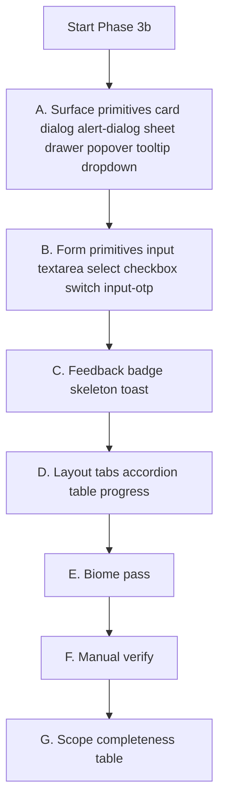

# Phase 3b — UI primitives sweep

**Fulfills:** original Phase 3 in [docs/design-system-roadmap.md](docs/design-system-roadmap.md) (UI primitives sweep).
**Predecessor work:** Phase 1 (tokens/typography base), Phase 2 (font rollout), Phase 3a (elevation tokens), Phase 4 (marketing remainder).
**Deferred out of this phase:** `sidebar.tsx` (rolls into Phase 7 — SaaS chrome).

## Goal

Replace legacy `shadow-[var(--card-shadow)]`, `shadow-xs`, `shadow-lg`, `shadow-md`, `transition-all`, and hardcoded color chips in base primitives with the existing Phase 3a tokens and semantic theme vars. After this phase, SaaS, admin, auth, and pricing surfaces that already use `<Card>`, `<Dialog>`, `<Input>`, etc. pick up the new design system with **zero per-call-site changes**.

## Guiding rules

1. **No public API changes** — all exports, prop signatures, forwarded refs stay identical.
2. **Conservative defaults** — input/select `h-9` stays; no layout-shifting size changes.
3. **Scoped transitions** — `transition-all` becomes `transition-[properties]` to avoid animating inherited layout props.
4. **Use existing utilities** — `.shadow-flat`, `.shadow-raised`, `.shadow-elevated`, `.shadow-overlay`, `.shadow-modal` already exist in [apps/web/app/globals.css](apps/web/app/globals.css). No new tokens are introduced here.
5. **Biome-clean** — run `pnpm exec biome check --write` on every modified file before handoff.

## Elevation ladder (how tokens map to primitive types)

| Surface class | Token | Used for |
|---|---|---|
| Flush UI (cards, form inputs) | `shadow-flat` | Resting `<Card>`, rarely anything else |
| Small floating chrome | `shadow-raised` | Switch thumb, checkbox, button-like chrome |
| Hover-lifted cards / inline popovers | `shadow-elevated` / `shadow-elevated-desktop` | Card hover states (marketing already uses) |
| Dropdowns, selects, tooltips, toasts | `shadow-overlay` | Any popover-layer content |
| Dialogs, alert dialogs, sheets, drawers | `shadow-modal` / `shadow-modal-desktop` | Modal surfaces |

## Scope — primitive-by-primitive

### A. Surface / container primitives

#### A1. [card.tsx](apps/web/modules/ui/components/card.tsx)
- L11 change: `shadow-[var(--card-shadow)]` → `shadow-flat`.
- Keep `rounded-2xl border bg-card text-card-foreground` exactly as-is.

#### A2. [dialog.tsx](apps/web/modules/ui/components/dialog.tsx)
- L38 `DialogContent`: replace `shadow-lg duration-200` with `shadow-modal md:shadow-modal-desktop duration-200` (keep existing radix animation classes; duration for open/close anims stays 200 until global motion phase).
- L44 `DialogPrimitive.Close`: `transition-opacity` is already scoped — no change.

#### A3. [alert-dialog.tsx](apps/web/modules/ui/components/alert-dialog.tsx)
- L35 `AlertDialogContent`: `shadow-lg duration-200` → `shadow-modal md:shadow-modal-desktop duration-200`.
- L20 overlay: keep `bg-black/80` (intentional high-contrast destructive modal overlay) unless you prefer `bg-background/80` for consistency with `dialog`. Default: keep.

#### A4. [sheet.tsx](apps/web/modules/ui/components/sheet.tsx)
- L34 `sheetVariants`: replace `shadow-lg` in base string with `shadow-modal md:shadow-modal-desktop`.
- L68 `SheetPrimitive.Close`: scoped transition already — no change.

#### A5. [drawer.tsx](apps/web/modules/ui/components/drawer.tsx)
- L45 `DrawerContent`: has no shadow currently → add `shadow-overlay` (drawer sits at overlay elevation on mobile).

#### A6. [popover.tsx](apps/web/modules/ui/components/popover.tsx)
- L21 `PopoverContent`: `shadow-md` → `shadow-overlay`.

#### A7. [tooltip.tsx](apps/web/modules/ui/components/tooltip.tsx)
- L21 `TooltipContent`: `shadow-md` → `shadow-raised` (tooltips are small, elevation-light; `shadow-overlay` would feel heavy on a 24px-tall element).

#### A8. [dropdown-menu.tsx](apps/web/modules/ui/components/dropdown-menu.tsx)
- L47 `DropdownMenuSubContent`: `shadow-lg` → `shadow-overlay`.
- L63 `DropdownMenuContent`: `shadow-lg` → `shadow-overlay`.
- L81, L97, L119 `DropdownMenuItem`/`CheckboxItem`/`RadioItem`: already `transition-colors` — no change.

### B. Form primitives

#### B1. [input.tsx](apps/web/modules/ui/components/input.tsx)
- L13: `h-9 … shadow-xs border border-input` → `h-9 … shadow-flat border border-input`.
- Keep `transition-colors` (already property-scoped).
- Height `h-9` preserved to avoid form layout shifts across every auth form, settings form, admin dialog.

#### B2. [textarea.tsx](apps/web/modules/ui/components/textarea.tsx)
- L11: `shadow-xs border border-input` → `shadow-flat border border-input`.

#### B3. [select.tsx](apps/web/modules/ui/components/select.tsx)
- L22 `SelectTrigger`: `h-9 … shadow-xs border border-input` → `h-9 … shadow-flat border border-input`.
- L43 `SelectContent`: `shadow-md` → `shadow-overlay`.

#### B4. [checkbox.tsx](apps/web/modules/ui/components/checkbox.tsx)
- L15: `shadow-sm` → `shadow-flat`. Border/colors unchanged.

#### B5. [switch.tsx](apps/web/modules/ui/components/switch.tsx)
- L21 `SwitchPrimitives.Thumb`: `shadow-lg` → `shadow-raised` (thumb is a small floating chrome element — `shadow-lg` was too heavy).
- L13 root already uses scoped `transition-colors`.

#### B6. [radio-group.tsx](apps/web/modules/ui/components/radio-group.tsx)
- No shadow/token leaks; current classes already on tokens. **No change** (flag only in scope table as "audited, no-op").

#### B7. [input-otp.tsx](apps/web/modules/ui/components/input-otp.tsx)
- L54 `InputOTPSlot`: `shadow-xs transition-all` → `shadow-flat transition-[box-shadow,border-color,color]` (keep animated-caret logic untouched).

### C. Feedback primitives

#### C1. [badge.tsx](apps/web/modules/ui/components/badge.tsx)
- L19–L24 `status` variants: migrate `success` and `error` to theme tokens. Keep `info` and `warning` as-is (warning has no theme token).
  - `success`: `bg-emerald-500/10 text-emerald-500` → `bg-success/10 text-success`.
  - `error`: `bg-rose-500/10 text-rose-500` → `bg-destructive/10 text-destructive`.
- Exported `badge` cva + `Badge` component signature stay identical.

#### C2. [alert.tsx](apps/web/modules/ui/components/alert.tsx)
- Already theme-token driven (`bg-primary/10 text-primary`, `bg-destructive/10 text-destructive`, `bg-success/10 text-success`). **No change** (flag only in scope table).

#### C3. [skeleton.tsx](apps/web/modules/ui/components/skeleton.tsx)
- L9: `bg-primary/10` → `bg-foreground/5`. Preserves warm tone without fighting brand-orange CTAs on loading dashboards.

#### C4. [toast.tsx](apps/web/modules/ui/components/toast.tsx)
- L17: `group-[.toaster]:shadow-md` → `group-[.toaster]:shadow-overlay`. Keep all other Sonner class wiring.

### D. Layout primitives (audit + minor)

#### D1. [tabs.tsx](apps/web/modules/ui/components/tabs.tsx)
- L28 `TabsTrigger`: `transition-all` → `transition-[color,border-color]`. Everything else identical.

#### D2. [accordion.tsx](apps/web/modules/ui/components/accordion.tsx)
- L25 `AccordionTrigger`: `transition-all hover:underline` → `transition-[color,transform] hover:underline` (chevron rotate still animates via `[&[data-state=open]>svg]:rotate-180`).

#### D3. [table.tsx](apps/web/modules/ui/components/table.tsx)
- L62 `TableHead`: `text-foreground/60` → `text-muted-foreground`.
- L87 `TableCaption`: `text-foreground/60` → `text-muted-foreground`.
- No shadow/layout changes; matches pattern used everywhere else after Phase 1.

#### D4. [progress.tsx](apps/web/modules/ui/components/progress.tsx)
- L20: `transition-all` is on the indicator width animation — replacing would require measuring layout. **Leave as-is, flag in scope table.** Progress is fine with `transition-all` because the only changing prop is `transform`.

#### D5. [popover.tsx / tooltip.tsx / dropdown-menu.tsx / select.tsx / dialog.tsx / sheet.tsx]
- All use radix `data-[state=open]:animate-in` and `data-[state=closed]:animate-out` — radix-driven, not `transition-all`. **Leave alone.**

### E. Explicitly deferred

| File | Why deferred | Lands in |
|---|---|---|
| [sidebar.tsx](apps/web/modules/ui/components/sidebar.tsx) | 700+ lines; tightly coupled to SaaS/admin chrome | Phase 7 (SaaS chrome) |
| [calendar.tsx](apps/web/modules/ui/components/calendar.tsx) | react-day-picker internals — separate calendar audit | Phase 10 |
| [label.tsx](apps/web/modules/ui/components/label.tsx), [form.tsx](apps/web/modules/ui/components/form.tsx), [collapsible.tsx](apps/web/modules/ui/components/collapsible.tsx), [separator.tsx](apps/web/modules/ui/components/separator.tsx), [scroll-area.tsx](apps/web/modules/ui/components/scroll-area.tsx), [avatar.tsx](apps/web/modules/ui/components/avatar.tsx) | No shadow / no hardcoded colors / no `transition-all` | Audited, no-op |
| `responsive-dialog.tsx` | Pure composition over `dialog` + `drawer` — inherits automatically | Audited, no-op |
| `password-input.tsx` | Wraps `<Input>` only — inherits automatically | Audited, no-op |
| [Icon.tsx](apps/web/modules/ui/components/Icon.tsx) | Icon wrapper, no styling leak | Audited, no-op |

## Execution order

Rationale for order: surface → forms → feedback → layout matches the dependency fan-out. If Biome catches an issue in group A, we fix before compounding later changes.

## Verification

### Biome
`pnpm exec biome check --write` on every modified file. Fix any lint/format issues introduced.

### Manual verify checklist (at least one screen per consumer surface)

- **Marketing** (already styled — verify no regression): home hero, pricing-cards popular ring, FAQ accordion, help-center article card, blog list card. Expect: visually identical or marginally improved modal shadows on any dialog trigger.
- **SaaS**: `/app/settings` page — look for `<Input>`, `<Select>`, `<Card>`, `<Switch>`, `<Checkbox>` picking up new tokens. Expect: inputs feel slightly softer in dark mode (`shadow-flat` is richer than `shadow-xs`).
- **SaaS dashboards with skeletons**: `/app/app` (UserStart), TikTok dashboard, affiliate dashboard. Expect: skeletons now warm gray instead of orange pulse.
- **Auth**: `/auth/login`, `/auth/signup`, `/auth/forgot-password`, `/auth/otp`. Expect: inputs pick up new shadow, no height shift, no copy layout changes.
- **Admin dialogs**: Any `ManageSubscriptionDialog` / `AddUserDialog`. Expect: dialog now uses `shadow-modal` — on dark theme a noticeable richer shadow.
- **Pricing**: [PricingTable.tsx](apps/web/modules/saas/payments/components/PricingTable.tsx) still uses its own `shadow-[var(--card-shadow)]` on the plan card (line 188) — that's Phase 5's job, not 3b's.
- **Tooltips / dropdowns**: Open user menu dropdown and any tooltip — expect slightly stronger overlay shadow on dark mode.
- **Toasts**: Trigger a toast (e.g. save a settings form). Expect overlay elevation.
- **Badges**:
  - Find an error badge (admin subscription status or form validation pill) — expect **shift from rose to red**. This is the known, approved visual change.
  - Find a success badge — expect subtle green shift, more theme-aligned.
- **Light + dark theme toggle** on at least one page per surface.

### Known regression risk callouts

1. **Badge error color shift** (rose → red) — approved in pre-plan Q&A.
2. **Skeleton warmth change** (orange tint → warm gray) — approved in pre-plan Q&A.
3. **`shadow-modal` is visibly richer than `shadow-lg`** on dark theme — this is the intended effect; previous dialogs felt floaty on near-black bg.

## Scope completeness table (fill after execution)

| Primitive | Planned change | Status | Evidence |
|---|---|---|---|
| card.tsx | shadow-flat | DONE/DEFERRED/ROLL-IN | line ref |
| dialog.tsx | shadow-modal + desktop | | |
| alert-dialog.tsx | shadow-modal + desktop | | |
| sheet.tsx | shadow-modal + desktop | | |
| drawer.tsx | shadow-overlay | | |
| popover.tsx | shadow-overlay | | |
| tooltip.tsx | shadow-raised | | |
| dropdown-menu.tsx | shadow-overlay x2 | | |
| input.tsx | shadow-flat | | |
| textarea.tsx | shadow-flat | | |
| select.tsx trigger | shadow-flat; content shadow-overlay | | |
| checkbox.tsx | shadow-flat | | |
| switch.tsx thumb | shadow-raised | | |
| radio-group.tsx | audit no-op | | |
| input-otp.tsx | shadow-flat + scoped transition | | |
| badge.tsx | success/error → tokens | | |
| alert.tsx | audit no-op | | |
| skeleton.tsx | bg-foreground/5 | | |
| toast.tsx | shadow-overlay | | |
| tabs.tsx | scoped transition | | |
| accordion.tsx | scoped transition | | |
| table.tsx | muted-foreground | | |
| progress.tsx | audit keep transition-all | | |
| sidebar.tsx | DEFERRED | Phase 7 | — |
| calendar.tsx | DEFERRED | Phase 10 | — |

## What I will NOT do in this phase

- Modify `sidebar.tsx` (Phase 7).
- Introduce new design tokens or motion variables (Phase 10).
- Touch call-sites in SaaS/marketing/admin (primitives-only).
- Change component public APIs (props, exports, refs).
- Rework `PricingTable.tsx` / `BillingContent.tsx` (Phase 5).
- Run `next build` / full typecheck (scope is CSS/class changes, not types).
