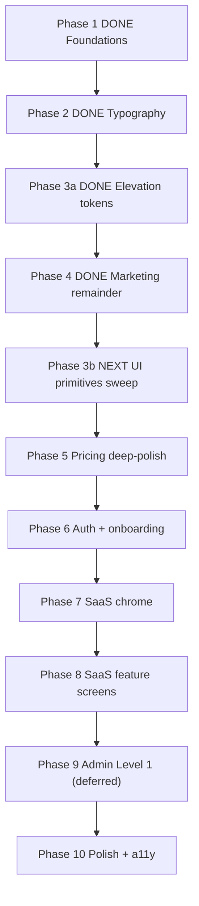

# Formalize the reconciled design-system roadmap

## Goal

Stop the roadmap drift. Write one canonical document at `docs/design-system-roadmap.md` (new file) that captures:

1. What we actually shipped (evidence-backed, not from memory)
2. What's still missing from your original 10-phase plan
3. The corrected forward path, with explicit ownership of each phase

After you approve the document content, the next turn picks the execution phase (original Phase 3 primitives sweep vs. Phase 5 pricing vs. other) and a fresh implementation plan is drafted for that phase only.

## Document structure

### Section 1: What shipped (verified, phase-by-phase)

**Phase 1 — Foundations (DONE, verified)**
- [tooling/tailwind/theme.css](tooling/tailwind/theme.css): orange brand tokens, `--card-shadow`, radius tokens
- [apps/web/modules/ui/components/button.tsx](apps/web/modules/ui/components/button.tsx): variant refresh
- [apps/web/modules/marketing/shared/components/NavBar.tsx](apps/web/modules/marketing/shared/components/NavBar.tsx): glass nav
- `color-mix(in oklch, ...)` for muted-foreground

**Phase 2 — Typography rollout (DONE, verified — iterated through 2.5 + Option 1 flip)**
- [apps/web/modules/shared/components/Document.tsx](apps/web/modules/shared/components/Document.tsx): Fraunces + Inter via `next/font/google`
- Fraunces for display H1/H2/section headers on marketing home + pricing-cards + FAQ
- Inter for everything else
- Note: did NOT reach auth forms beyond subtitle copy tweaks — marked as carryover

**Phase 3 — Depth & elevation tokens (DONE at call-sites only)**
- [tooling/tailwind/theme.css](tooling/tailwind/theme.css): added `--shadow-flat/raised/elevated/overlay/modal/brand-glow` with light + dark + desktop variants
- [apps/web/app/globals.css](apps/web/app/globals.css): exposed as `.shadow-flat` etc.
- Applied at marketing call-sites only (hero, pricing-cards, NavBar)
- **Gap: base UI primitives ([card.tsx](apps/web/modules/ui/components/card.tsx), [dialog.tsx](apps/web/modules/ui/components/dialog.tsx), [input.tsx](apps/web/modules/ui/components/input.tsx), [tabs.tsx](apps/web/modules/ui/components/tabs.tsx), [select.tsx](apps/web/modules/ui/components/select.tsx), [badge.tsx](apps/web/modules/ui/components/badge.tsx), [sheet.tsx](apps/web/modules/ui/components/sheet.tsx), [drawer.tsx](apps/web/modules/ui/components/drawer.tsx), [dropdown-menu.tsx](apps/web/modules/ui/components/dropdown-menu.tsx)) never received the tokens.** This was your original Phase 3 and is still outstanding.

**Phase 4 — Marketing remainder (DONE, verified)**
- Benefits, StickyCTA, Footer, Contact, Blog, Changelog, HelpCenter (all sub-routes), Legal, Docs routes
- Deleted dead code: `Hero.tsx`, `Features.tsx`, legacy `FaqSection.tsx`, `PricingSection.tsx`, `Newsletter.tsx`
- Typography + elevation consistent across marketing surfaces

### Section 2: What's still outstanding (evidence-backed)

Cited from live files I read:

**Original Phase 3 — UI primitives sweep (NOT started)**
- All primitives listed above still use legacy patterns: `shadow-[var(--card-shadow)]`, `shadow-xs`, `shadow-lg`, `transition-all`, hardcoded color chips.

**Original Phase 5 — Pricing deep-polish (NOT started)**
- [PricingTable.tsx](apps/web/modules/saas/payments/components/PricingTable.tsx) line 41 `transition-all duration-700`, line 188 legacy `shadow-[var(--card-shadow)]`, line 190 `shadow-card-primary`, line 312 static ring
- [BillingContent.tsx](apps/web/modules/saas/payments/components/BillingContent.tsx): no typography or token upgrades
- Checkout flow (`/checkout/[plan]`, `/checkout/lifetime`, `/checkout/promo` + `PlanCheckoutClient`): unaudited
- `SubscriptionStatusBadge`, `CustomerPortalButton`: unaudited

**Original Phase 6 — Auth + onboarding (PARTIAL)**
- Done (2.5): LoginForm + SignupForm subtitle copy
- Not done: [ForgotPasswordForm.tsx](apps/web/modules/saas/auth/components/ForgotPasswordForm.tsx), [OtpForm.tsx](apps/web/modules/saas/auth/components/OtpForm.tsx), `ResetPasswordForm.tsx`, `LoginModeSwitch.tsx`, `SocialSigninButton.tsx`, `choose-plan`, `new-organization`, `organization-invitation`
- No Fraunces on auth H1s, no token shadows on auth cards

**Original Phase 7 — SaaS chrome (NOT started)**
- SaaS NavBar, MobileHeader, BottomNav, UserMenu, notifications dropdown, SettingsMenu

**Original Phase 8 — SaaS feature screens (NOT started)**
- Community hub, TikTok dashboard, content, affiliate, notifications, settings forms

**Original Phase 9 — Admin Level 1 (DEFERRED per your earlier choice)**

**Original Phase 10 — Polish (PARTIAL/NOT started)**
- Done: global `prefers-reduced-motion` CSS block
- Outstanding: skeletons, empty states, error pages, toast styling, focus audit, `useCardTilt` reduced-motion guard, full a11y sweep

### Section 3: Drift items I introduced that aren't in your original plan

These were useful but should be acknowledged as additive, not core:

- "Phase 5 marketing motion polish" (my draft) — a slice of original Phase 10 scoped to marketing. **Recommendation: fold into a revised original Phase 10, or roll into Phase 3 primitives sweep (since `tabs.tsx`/`dialog.tsx` etc. will need the same motion cleanup anyway).**
- "Phase 6 marketing spacing/rhythm" — similar slice, similar recommendation.
- "Phase 7 iconography", "Phase 8 marketing forms", "Phase 9 a11y" as I sketched — these were marketing-scoped fragments of original Phase 10 / Phase 3 / Phase 6. Roll them into the correct original phase rather than keeping them as standalone.

### Section 4: Corrected forward roadmap

- **Next: Phase 3b — UI primitives sweep.** The elevation tokens from 3a plus the typography from 2 flow into `card/dialog/input/tabs/select/badge/sheet/drawer/dropdown/sidebar` + any motion cleanup the primitives need. This unblocks everything below it because 5, 6, 7, 8 all consume these primitives.
- **Phase 5 – 10 scope** stays true to your original plan, but each phase description gets a "verified scope" paragraph at the top so we cannot drift again.

### Section 5: Governance rules to prevent future drift

Add to the doc so future phase plans self-check against the roadmap:

1. Every phase plan MUST cite the original phase number it fulfills (e.g. "this plan fulfills original Phase 5").
2. Any plan that adds a NEW phase must explicitly call out that it's additive and justify why.
3. Each phase ends with a "scope completeness check" — list every file/route the original plan targeted and mark DONE/DEFERRED/ROLL-INTO with evidence.
4. Mid-phase renames (like my Phase 3 rename from "primitives sweep" to "elevation tokens") must surface as a roadmap amendment, not a silent scope change.

## Output of this step

- One new file: `docs/design-system-roadmap.md` containing Sections 1-5 above
- No code changes
- After approval: you pick the next execution phase (I recommend Phase 3b UI primitives sweep) and I draft a fresh implementation plan for that single phase.

## What I will NOT do in this step

- No `StrReplace` on any `.ts/.tsx/.css` file
- No edits to existing plan markdown files
- No Biome runs
- No primitives sweep work; that's a separate plan after the roadmap is approved
