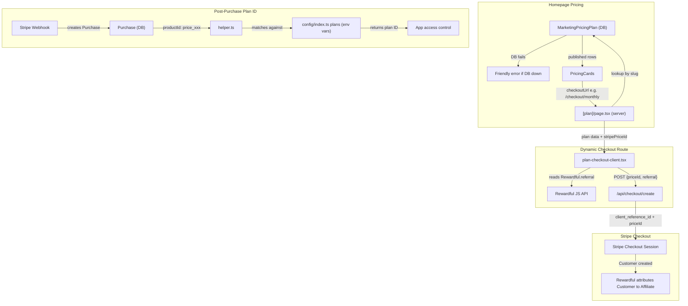

# Rewardful Subscription Attribution + Checkout Cleanup

## Architecture Overview




---

## Part 1: Fix Rewardful Attribution in `/api/checkout/create`

**File:** [apps/web/app/api/checkout/create/route.ts](apps/web/app/api/checkout/create/route.ts)

- Accept optional `referral` string from POST body (alongside existing `plan` and `priceId`)
- Pass `referral` as `client_reference_id` on the Stripe Checkout Session **only when it is a non-empty string** (Stripe errors on blank)
- Add `customer_creation: "always"` for `mode === "payment"` to future-proof one-time payment attribution

```typescript
const { plan, priceId, referral } = await request.json();

const session = await stripe.checkout.sessions.create({
  mode,
  line_items: [{ price: priceId, quantity: 1 }],
  success_url: `${baseUrl}/auth/post-checkout-login?session_id={CHECKOUT_SESSION_ID}`,
  cancel_url: `${baseUrl}/#pricing`,
  allow_promotion_codes: true,
  billing_address_collection: "auto",
  metadata: { plan },
  ...(referral ? { client_reference_id: referral } : {}),
  ...(mode === "payment" ? { customer_creation: "always" } : {}),
});
```

---

## Part 2: Dynamic `[plan]` Checkout Route

### 2a. Server component

**New file:** `apps/web/app/(marketing)/[locale]/checkout/[plan]/page.tsx`

- Extract `plan` slug from URL params
- Query `db.marketingPricingPlan.findFirst({ where: { checkoutUrl: /checkout/${slug}, published: true } })`
- If DB fails or no plan found, pass `plan: null` to client component
- If found, pass `{ name, price, period, description, features, badge, stripePriceId }` to client component

### 2b. Client component

**New file:** `apps/web/app/(marketing)/[locale]/checkout/[plan]/plan-checkout-client.tsx`

- If `plan` is null or `stripePriceId` is null, show friendly error: "Unable to Load Plan — We're experiencing technical difficulties..." with a "Return to Pricing" button
- Otherwise show plan confirmation card (name, price, features) with loading spinner
- Read `(window as any).Rewardful?.referral` as the referral ID
- POST to `/api/checkout/create` with `{ plan: planSlug, priceId: plan.stripePriceId, referral }`
- Redirect to Stripe on success, show error state on failure
- Pattern follows existing `lifetime-checkout-client.tsx` and `promo-checkout-client.tsx`

### 2c. Delete old hardcoded pages

- **Delete** [apps/web/app/(marketing)/[locale]/checkout/monthly/page.tsx](apps/web/app/(marketing)/[locale]/checkout/monthly/page.tsx)
- **Delete** [apps/web/app/(marketing)/[locale]/checkout/yearly/page.tsx](apps/web/app/(marketing)/[locale]/checkout/yearly/page.tsx)

No redirects needed — no active users.

---

## Part 3: Add Rewardful Referral to Lifetime and Promo Pages

**File:** [apps/web/app/(marketing)/[locale]/checkout/lifetime/lifetime-checkout-client.tsx](apps/web/app/(marketing)/[locale]/checkout/lifetime/lifetime-checkout-client.tsx)

- Before the fetch call, read `(window as any).Rewardful?.referral`
- Add `referral` to the JSON body sent to `/api/checkout/create`

**File:** [apps/web/app/(marketing)/[locale]/checkout/promo/promo-checkout-client.tsx](apps/web/app/(marketing)/[locale]/checkout/promo/promo-checkout-client.tsx)

- Same change.

---

## Part 4: Replace ChangePlan with Billing Portal

**File:** [apps/web/modules/saas/payments/components/ChangePlan.tsx](apps/web/modules/saas/payments/components/ChangePlan.tsx)

- Remove the current implementation that creates a new checkout session
- Replace with a component that calls the existing `orpc.payments.createCustomerPortalLink` mutation and redirects the user to the Stripe billing portal
- Keep the same visual card layout but change the button text to "Manage Subscription" and the description to explain they can upgrade, downgrade, or cancel through the portal

---

## Part 5: Update Config Plan Definitions and Env Vars

### 5a. Config

**File:** [config/index.ts](config/index.ts)

Update `payments.plans` to:

- `free` — unchanged (`isFree: true`)
- `starter_monthly` — new, references `NEXT_PUBLIC_PRICE_ID_STARTER_MONTHLY`, interval month
- `pro` — rename from current `pro`, two prices referencing `NEXT_PUBLIC_PRICE_ID_PRO_MONTHLY` (month) and `NEXT_PUBLIC_PRICE_ID_PRO_YEARLY` (year)
- `test_daily` — temporary, references `NEXT_PUBLIC_PRICE_ID_TEST_DAILY`, interval day (will be removed after testing)
- `test_2day` — temporary, references `NEXT_PUBLIC_PRICE_ID_TEST_2DAY`, interval 2-day (will be removed after testing)

### 5b. Plan display data

**File:** [apps/web/modules/saas/payments/hooks/plan-data.tsx](apps/web/modules/saas/payments/hooks/plan-data.tsx)

Add entries for:

- `starter_monthly` — title: "Starter"
- `test_daily` — title: "Test Daily"
- `test_2day` — title: "Test 2-Day"
- `manual_override` — title: "Manual Access"
- `no_active_plan` — title: "No Active Plan"

### 5c. Env file

**File:** [.env](.env)

- Rename `NEXT_PUBLIC_PRICE_ID_TIER1_MONTHLY` to `NEXT_PUBLIC_PRICE_ID_STARTER_MONTHLY`
- Rename `NEXT_PUBLIC_PRICE_ID_TIER2_MONTHLY` to `NEXT_PUBLIC_PRICE_ID_PRO_MONTHLY`
- Rename `NEXT_PUBLIC_PRICE_ID_TIER3_YEARLY` to `NEXT_PUBLIC_PRICE_ID_PRO_YEARLY`
- Add `NEXT_PUBLIC_PRICE_ID_TEST_DAILY=` (you fill in the price ID from your Stripe test product)
- Add `NEXT_PUBLIC_PRICE_ID_TEST_2DAY=` (you fill in the price ID from your Stripe test product)
- Remove `STRIPE_PRODUCT_ID`

### 5d. Env validation

**File:** [scripts/validate-env.ts](scripts/validate-env.ts)

- Replace `NEXT_PUBLIC_PRICE_ID_PRO_MONTHLY` / `NEXT_PUBLIC_PRICE_ID_PRO_YEARLY` with new names
- Remove `STRIPE_PRODUCT_ID`
- Add `NEXT_PUBLIC_PRICE_ID_STARTER_MONTHLY`

---

## Part 6: Update helper.ts Plan Identification

**File:** [packages/payments/src/lib/helper.ts](packages/payments/src/lib/helper.ts)

- Change manual override return from `id: "pro"` to `id: "manual_override"`
- When no plan matches a purchase's `productId` (falls through all checks), instead of returning the `free` plan silently, return `id: "no_active_plan"` and fire an admin notification via `notifyAllAdmins` with: "User has a purchase (productId: {id}) that doesn't match any configured plan. Check config/index.ts plan definitions."

---

## Part 7: Clean Up Dead Code

**File:** [config/constants.ts](config/constants.ts)

- Remove `STRIPE_CONFIG` object entirely (neither `STRIPE_PRODUCT_ID` nor `STRIPE_DEFAULT_PRICE_ID` are used anywhere)

---

## Part 8: Homepage Pricing Fallback

**File:** [apps/web/modules/marketing/home/components/v0/pricing-preview.tsx](apps/web/modules/marketing/home/components/v0/pricing-preview.tsx)

- Remove the `defaultPlans` hardcoded array
- Remove the `defaultContent` hardcoded object
- In `getPricingData()`, if the DB query fails or returns no plans, return a flag indicating the error
- In the rendered output, when the error flag is set, show: "Pricing is temporarily unavailable. Please try again shortly." styled within the pricing section. The rest of the homepage renders normally.

---

## Part 9: Manual Steps (You Do After Code Is Deployed)

### Stripe Dashboard

- Register live webhook endpoint at `https://your-domain.com/api/webhooks/payments` with events: `checkout.session.completed`, `customer.subscription.created`, `customer.subscription.updated`, `customer.subscription.deleted`, `invoice.payment_succeeded`, `invoice.payment_failed`, `invoice.paid`
- Configure the Customer Portal (Settings > Billing > Customer portal): enable "Customers can switch plans", add all your prices to the allowed list
- Note the webhook signing secret (`whsec_live_...`)

### Vercel Environment Variables

- `STRIPE_SECRET_KEY` — set to live secret key (`sk_live_...`)
- `STRIPE_WEBHOOK_SECRET` — set to live webhook signing secret
- `NEXT_PUBLIC_PRICE_ID_STARTER_MONTHLY` — set to the Stripe price ID for starter monthly
- `NEXT_PUBLIC_PRICE_ID_PRO_MONTHLY` — set to the Stripe price ID for pro monthly ($99/mo)
- `NEXT_PUBLIC_PRICE_ID_PRO_YEARLY` — set to the Stripe price ID for pro yearly ($997/yr)
- `NEXT_PUBLIC_PRICE_ID_TEST_DAILY` — set to the $1/day test price ID
- `NEXT_PUBLIC_PRICE_ID_TEST_2DAY` — set to the $2/every-2-days test price ID
- `NEXT_PUBLIC_PRICE_ID_LIFETIME` — keep as-is or update to live price ID when ready
- Remove `STRIPE_PRODUCT_ID`

### Rewardful Dashboard

- Settings > Integrations > Stripe — verify connected to **live** Stripe account (not test)
- Verify campaign is in live mode

### Database (via Admin Dashboard at `/admin/marketing`)

- Edit existing pricing plan rows: update `stripePriceId` to live price IDs
- For testing: create test plan rows with `checkoutUrl: "/checkout/test-daily"` and `"/checkout/test-2day"`, set `stripePriceId` to your test product prices, set `published: true`
- After testing: unpublish or delete the test plan rows

### Testing Checklist

1. Visit site via affiliate link (`?via=chrisrecord` or your test affiliate)
2. Open browser console, run `Rewardful.referral` — confirm it returns a UUID
3. Click a test pricing card, verify checkout page loads with plan details
4. Complete checkout with real card ($1)
5. Check Stripe Dashboard — confirm `client_reference_id` is set on the Checkout Session
6. Check Rewardful Dashboard — confirm conversion appears linked to the affiliate
7. Go to Settings > Billing in the app — click "Manage Subscription" to open Stripe portal
8. Switch from $1/day to $2/every-2-days price
9. Wait for next billing cycle, check Rewardful shows updated commission amount
10. Clean up: cancel test subscriptions, refund charges, unpublish test plans, remove test plan config entries and env vars

